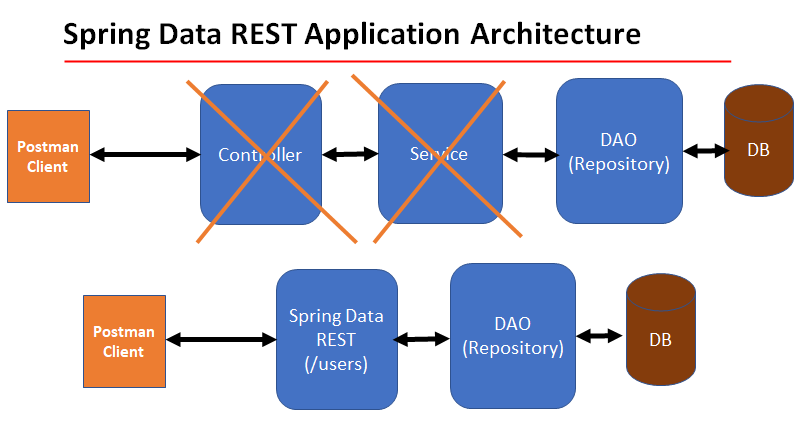

# Spring Data REST



- Spring Data REST APIs are HATEOS compliant
- Response of the REST APIs in HATEOS format
- Response contains meta-data links to data

## HATEOAS (Hypermedia as the Engine Of Application State)

- A constraint of the REST application architecture
- Less coupling with URI structures

```
// Example of HATEOAS

{
  "links": {
    "self": { "href": "http://api.com/items" },
    "item": [
      { "href": "http://api.com/items/1" },
      { "href": "http://api.com/items/2" }
    ]
  },
  "data": [
    { "itemName": "a" },
    { "itemName": "b" }
  ]
}
```